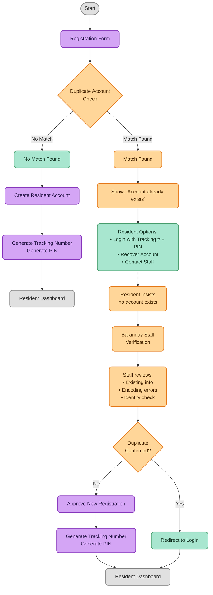

# Figure 2. Registration with Duplicate Account Detection

**Figure 2.** Registration process with duplicate account detection. The system checks for existing records using First Name, Last Name, and Date of Birth before creating a new account. If a match is found, the resident is guided to log in or contact Barangay Staff for verification. Staff can override the duplicate if it is a false positive.

### Validator Considerations

1. **Duplicate Detection Criteria:** The primary matching fields are **First Name**, **Last Name**, and **Date of Birth**. An additional field such as **Barangay/Purok** may be used as a tie-breaker to reduce false matches.

2. **Staff Override:** If a duplicate is detected but the resident claims they do not already have an account, Barangay Staff can review the records, verify identity, and approve a legitimate new registration if the records do not actually belong to the same person.
